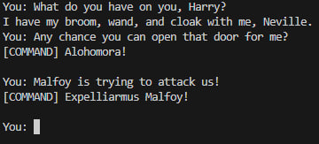

# GPT Commands Python

A python module that provides an easy way to use OpenAI GPT-4 (or 3.5) [function calling](https://platform.openai.com/docs/guides/gpt/function-calling), which is basically GPT plugins in API world.

Just create a class with your custom logic:

```python
class Game:
    def get_inventory(self, character: str, max_items: int) -> List[str]:
        """
        Get inventory of a character

        Args:
            character (str): The name of the character to get the inventory of. One of: 'Harry', 'Ron', 'Hermione'
            max_items (int): The maximum number of items to return
        Returns:
            List[str]: The inventory of the character
        """
        if character == "Harry":
            return ["Wand", "Broom", "Cloak"]
        elif character == "Ron":
            return ["Wand", "Rat"]
        elif character == "Hermione":
            return ["Wand", "Cat", "Book"]

        return []

    def alohomora(self):
        """
        Unlock the door
        """
        print("[COMMAND] Alohomora!")

    def expelliarmus(self, target: str):
        """
        Disarm the target

        Args:
            target (str): The target to disarm
        """
        print(f"[COMMAND] Expelliarmus {target}!")

```

Make sure to annotate your code with type hints and doc strings. This is what the module uses to "explain" the functions to GPT.

Then pass an instance of your class to `GPTCommandsClient` like so and start prompting:

```python
manager = Game()
model = "gpt-4-0613"  # "gpt-3.5-turbo-16k-0613"
async with GPTCommandsClient(model, system_prompt) as client:
    while True:
        prompt = input("You: ")
        async for data in client.chat_stream(prompt, manager):
            print(data, end="")
        print()
```



List of currently supported types for parameters:
- `bool`
- `int`
- `float`
- `str`
- `List[T]`
- `Dict[str, T]`
- `Optional[T]`
- `@dataclass` marked classes with `JsonSchemaMixin`

See [example](./src/gpt_commands/example/__main__.py) for a full example.

## Installation

1.  Create environment

    Create a new conda environment from `environment.yml` and activate it:

    ```shell
    conda env create -f environment.yml
    conda activate gptcommands
    ```

    You might need to [install conda](https://docs.conda.io/projects/conda/en/latest/user-guide/install/index.html) first.

1.  Set environment variables

    Copy `.env.example` file and rename it to `.env`.
    Then set your [OpenAI API key](https://platform.openai.com/account/api-keys) (and optionally your organization ID).
    Your `.env` file should look someting like this:

    ```
    OPENAI_API_KEY=sk-XXXXXXXXXXXXXXXXXXXXXXXXXXXXXXXXXXXXXXXXXXXXXXXX
    OPENAI_ORGANIZATION=org-XXXXXXXXXXXXXXXXXXXXXXXX
    ```

## Running the example

```shell
cd src
python -m gptcommands.example
```